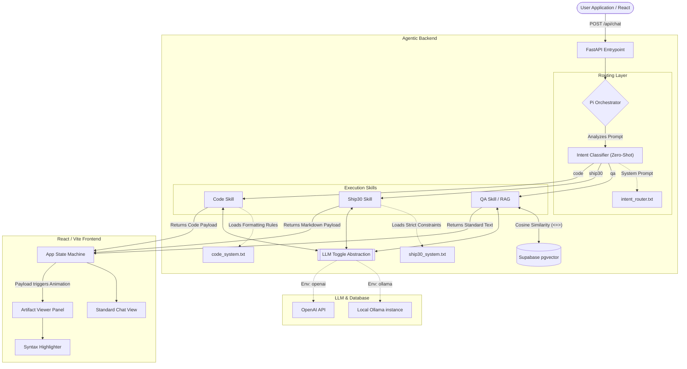

# Deep System Architecture Document

## Overview

The Lenny Growth Assistant represents a paradigm shift from simple Retrieval-Augmented Generation (RAG) wrappers to a fully orchestrated Agentic System. It uses dynamic routing to understand user intent, executes specialized programmatic "Skills," and streams artifacts to a reactive frontend.

---

## 🏗️ End-to-End System Diagram



---

## 1. Frontend Architecture (React)

The frontend is a Vite-powered React Single Page Application (SPA). It completely decouples the conversational state from the artifact presentation layer.

### Component Deep Dive
- **`App.jsx`**: The root state container. It manages the `currentSessionId`, the `messages` array, and handles all asynchronous communication with the FastAPI backend using `fetch`.
- **`Sidebar.jsx`**: Manages the persistence layer visually. It automatically truncates long session titles using flexbox constraints and handles active-session styling.
- **`ArtifactViewer.jsx`**: The crown jewel of the UI. Rather than a blocking modal, it uses CSS flexbox animations to smoothly slide in from the right when an artifact payload is detected. 
  - It utilizes `react-markdown` to parse formatted text.
  - It utilizes `react-syntax-highlighter` (with the `vscDarkPlus` theme) to inject professional-grade code formatting into code blocks.

---

## 2. Agentic Routing Logic (The Orchestrator)

The core innovation of the Lenny Growth Assistant is the **Pi Orchestrator** (`pi_orchestrator.py`). Traditional systems force every query through a vector search. If a user asks "Write a javascript function", a traditional RAG system will search the database for javascript, fail to find it, and hallucinate. Our system prevents this via **Intent Classification**.

### The Orchestration Lifecycle
1. **Zero-Shot Classification**: When a query hits `/api/chat`, the orchestrator intercepts it. It strips away all historical conversational context to prevent LLM bias. It sends *only* the raw query to the intent router using the `intent_router.txt` prompt.
2. **Labeling**: The LLM acts purely as a classifier, returning exactly one string: `qa`, `ship30`, or `code`.
3. **Skill Dispatching**: The orchestrator triggers the specific Python skill module.

### Deep Dive into Skills
- **`qa_skill.py` (The RAG Engine)**:
  - Generates a 768-dimensional embedding of the user's query.
  - Executes an RPC call to Supabase using the `<=>` (cosine similarity) operator to retrieve the Top-8 most semantically similar transcript chunks.
  - Constructs a highly grounded context window and queries the LLM. If the answer isn't in the context, it strictly returns "I don't know."
- **`ship30_skill.py` (The Essay Writer)**:
  - Bypasses the vector database entirely.
  - Loads `ship30_system.txt`, which strictly enforces 1200-word limits, formatting constraints, and viral hook generation.
  - **Sanitization**: It actively strips surrounding markdown backticks (` ``` `) from the LLM output to prevent the React frontend from rendering the essay as a single, giant monolithic code block. Returns an `artifact` dict of type `markdown`.
- **`code_skill.py` (The Engineer)**:
  - Loads `code_system.txt`.
  - Generates raw software logic. 
  - Uses regex to extract only the code from the LLM's conversational fluff. Returns an `artifact` dict of type `code`.

---

## 3. The LLM Toggle Switch (Provider Abstraction)

To prevent vendor lock-in and enable zero-cost local development, the LLM communication layer is heavily abstracted (`providers.py`).

### Abstract Factory Pattern
The system defines an abstract base class `LLMProvider` with two required async methods: `chat()` and `embed()`.
- **`OllamaProvider`**: Uses the `httpx` async client to talk directly to `http://localhost:11434`. It includes advanced error boundaries that intercept `404` errors (e.g., if the user hasn't pulled `qwen2.5:7b` yet) and gracefully propagates them to the frontend.
- **`OpenAIProvider`**: Uses the official `openai` SDK to hit cloud endpoints.

A factory function `get_provider()` reads the `.env` file at startup. A single variable change (`LLM_PROVIDER=ollama` -> `LLM_PROVIDER=openai`) instantly rewires the entire backend's neural pathways without touching a single line of business logic.

---

## 4. Database & Vector Schema (Supabase)

The system uses PostgreSQL for relational integrity and the `pgvector` extension for machine learning retrieval.

### Schema Details
1. **`sessions` Table**:
   - Serves as the relational root. Auto-generates titles based on the first query.
2. **`messages` Table**:
   - Stores the raw `content` (what the user sees in the chat bubble).
   - Stores `artifact_type` (`code`, `markdown`) and `artifact_content`. This schema design natively absorbs the dynamic payloads generated by the Skills without requiring JSON blob parsing or expensive migrations.
3. **`transcripts` Table**:
   - The knowledge base. Data is pre-chunked to prevent LLM context-window overflow. 
   - Uses `VECTOR(768)` to store the `nomic-embed-text` embeddings, enabling mathematically precise similarity scoring.

---

## 5. File Structure

```text
lenny-growth-assistant/
├── agent_transcripts/
│   ├── mixed_50_results.json
│   └── rag_baseline_results.json
├── backend/
│   ├── app/
│   │   ├── agents/
│   │   ├── api/
│   │   ├── db/
│   │   ├── llm/
│   │   ├── prompts/
│   │   ├── rag/
│   │   ├── schemas/
│   │   ├── services/
│   │   ├── skills/
│   │   ├── utils/
│   │   └── main.py
│   ├── tests/
│   ├── Makefile
│   └── requirements.txt
├── docs/
│   ├── api.md
│   ├── architecture.md
│   ├── design.md
│   ├── PRD.md
│   └── video_presentation_guide.md
├── frontend/
│   ├── public/
│   ├── src/
│   │   ├── components/
│   │   │   ├── ArtifactViewer.jsx
│   │   │   ├── ChatInput.jsx
│   │   │   └── Sidebar.jsx
│   │   ├── App.jsx
│   │   ├── index.css
│   │   └── main.jsx
│   ├── package.json
│   └── vite.config.js
└── README.md
```
